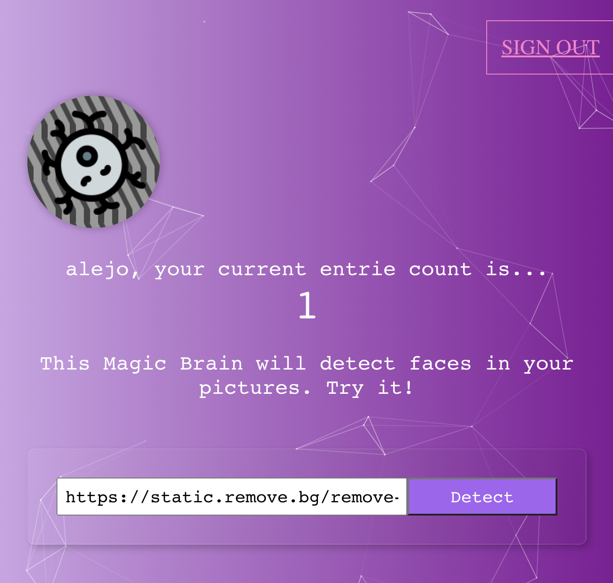

# smart-brain

 

</a>

 

 

</a>

 

 

</a>

 

## Summary

This is a simple project that lets you upload an image, and it will detect the faces in it using AI.

# License

This project is licensed under the [MIT license](LICENSE).
